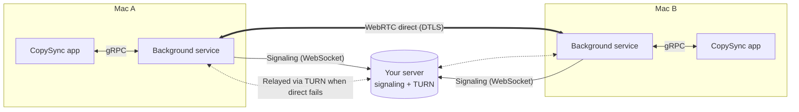

<p align="center">
  
</p>

<h1 align="center">CopySync</h1>

<p align="center">
  Copy on one Mac, paste on the other.<br>
  Text, images, files and whole folders — across Apple IDs and across networks.
</p>

<p align="center">
  <a href="https://github.com/baiyuze/copysync/releases/latest"><strong>Download for macOS</strong></a>
  ·
  <a href="https://baiyuze.github.io/copysync/en/">Website</a>
  ·
  <a href="README.md">简体中文</a>
</p>

<p align="center">
  
  
  
  
</p>

<p align="center">
  
</p>

> The app's interface is in Simplified Chinese for now. The screenshots below are annotated in the alt text.

## Why

If you work on two Macs, you move things between them all day: a snippet of text, a screenshot, a file.

The built-in options each get in the way:

- **Universal Clipboard** needs both Macs on the same Apple ID, close to each other, with Bluetooth and Wi‑Fi on. A work Mac and a personal Mac rarely share an Apple ID, and large files often fail halfway.
- **AirDrop** makes you pick a device and accept on the other side every time, and it only moves files, not the clipboard.
- **Messaging yourself** through a chat app means manual downloads, recompressed images, and your files sitting on someone else's server.

With CopySync you pair two Macs once. After that, `⌘C` on one and `⌘V` on the other. Data goes directly between the devices; when a direct connection can't be made, it is relayed through a server you run yourself. Everything is end-to-end encrypted and the server cannot read it.

| | CopySync | Universal Clipboard | AirDrop | Chat apps |
|---|:-:|:-:|:-:|:-:|
| Different Apple IDs | ✓ | — | Needs accepting | ✓ |
| Different networks (home ↔ office) | ✓ | — | — | ✓ |
| Paste right away, nothing to accept | ✓ | ✓ | — | — |
| Files and whole folders | ✓ | Unreliable | ✓ | Zipped |
| History of what you copied | ✓ | — | — | Scroll back |
| Content stays off third-party servers | ✓ | ✓ | ✓ | — |

## Features

- **Text, rich text, images, files and folders.** What you copy is what comes out on the other side.
- **Size-aware transfer.** Anything under 50 MB (adjustable) is pushed as soon as you copy, so the other Mac can paste immediately. Larger files sync as a record you can pull when you need them.
- **History.** Everything copied on any of your Macs in the last 3 days (adjustable), ready to put back on the clipboard.
- **Direct first, relay as fallback.** Devices connect peer-to-peer; behind symmetric NAT or a strict firewall, traffic switches to the TURN relay on your server automatically.
- **Fingerprint check when pairing**, so neither the server nor anyone on the network can impersonate your device.
- **Runs in the background.** Keeps syncing with the window closed, starts at login, recovers from crashes.
- **Native on Intel and Apple silicon**, light and dark appearance.

<table>
  <tr>
    <td></td>
    <td></td>
  </tr>
  <tr>
    <td></td>
    <td></td>
  </tr>
</table>

## Supported systems

| | Requirement |
|---|---|
| **Mac app** | macOS 13 Ventura or later; universal binary for Intel and Apple silicon, no Rosetta needed |
| **Server** | Any Linux on x86_64 or ARM64 with systemd or Docker; it can also run on one of your Macs |
| **Windows** | Planned |
| **iPhone / iPad** | Not supported. iOS does not let apps watch the clipboard in the background, so copy-and-it's-there can't work the way it does on the Mac |

## Install

There are two parts: **the app on each Mac**, and **a server both Macs can reach**. If both Macs are on the same LAN, the server can run on one of them.

### 1. Deploy the server

On a Linux server, as root:

```bash
curl -LO https://github.com/baiyuze/copysync/releases/latest/download/copysync-server-linux-amd64.tar.gz
tar xzf copysync-server-linux-amd64.tar.gz
cd copysync-server-linux-amd64
sudo ./install.sh <public IP of the server>
```

The script registers a systemd service that starts on boot and prints the address to enter in the app. Use the `linux-arm64` package on ARM servers.

Open these ports in your firewall or cloud security group:

| Port | Protocol | Purpose |
|---|---|---|
| 8787 | TCP | Signaling (WebSocket) |
| 3478 | UDP | STUN / TURN |
| 32768–60999 | UDP | TURN relay ports, assigned by the OS |

For Docker, or for LAN-only use, see the [server deployment guide](server/deploy/README.md).

### 2. Install the app on each Mac

1. Download [CopySync.dmg](https://github.com/baiyuze/copysync/releases/latest/download/CopySync.dmg), open it and drag CopySync into Applications.
2. Open CopySync from Applications.

   The first time, macOS says it can't verify the developer: CopySync isn't notarized by Apple yet (that requires a paid developer account). Go to **System Settings → Privacy & Security**, scroll down and click **Open Anyway**. You only need to do this once.

3. Click **启用后台同步** (Enable background sync).
4. In **设置 → 信令服务器地址** (Settings → Signaling server), enter `ws://<server address>:8787/signal` and press Return.
5. Recent versions of macOS ask whether CopySync Daemon may read the clipboard. Allow it; you can switch it to always allow under **System Settings → Privacy & Security → Paste from Other Apps**.

### 3. Pair

1. On one Mac: **设备 → 添加设备 → 生成配对码** (Devices → Add device → Generate code).
2. On the other: **添加设备 → 输入配对码** (Add device → Enter code), and type the 6 characters.
3. Both screens show the same two lines of fingerprints, one for each Mac. **Confirm only if the two screens match line for line.**

From then on, copy on either Mac and paste on the other.

## How it works



| Component | Role | Built with |
|---|---|---|
| Background service `copysyncd` | Watches the clipboard, connects to peers, sends, receives and stores | Go, with cgo calling AppKit for the clipboard |
| App `CopySync.app` | History, pairing, settings | Flutter, talks to the service over local gRPC |
| Server `copysync-server` | Device discovery, pairing codes, signaling, TURN relay | Go, a single static binary using about 15 MB of RAM |
| Protocol `proto/` | Messages shared by all three | Protocol Buffers |

**What happens when you copy:**

1. The service checks the clipboard's change count at short intervals. Reading the count and types needs no permission and never triggers a prompt.
2. On a change it reads the content and picks a transport: text is inlined in the message; images and files under 50 MB are streamed right away (tar + zstd); anything larger is announced as a record only.
3. The receiving Mac writes the data to a local cache and then onto its clipboard, so `⌘V` pastes real local files.

**How the connection is made:** devices connect to the signaling server over WebSocket and use WebRTC ICE to try a direct path (LAN addresses, then public addresses discovered via STUN), falling back to a TURN relay address. Data flows over WebRTC data channels, encrypted with DTLS.

### Security model

- **The server keeps no accounts.** A device's identity is an Ed25519 key, and its ID is derived from the public key, so the server can verify that an ID belongs to a key without a user table.
- **Fingerprints are compared by a person when pairing.** Both Macs show the same two lines: the fingerprint of each side's public key (the first 60 bits of its SHA-256, like `R8NF-2WTC-QL5J`), in a fixed order. The server could swap keys in transit, but then the two screens would no longer match — this step is what stops a man in the middle. The fingerprints are shown separately rather than combined into one short code: an attacker controlling both forged keys could find a matching combined code with a birthday attack, while separate fingerprints need a preimage attack per key, roughly a billion times harder.
- **Every signaling message after that is signed**, so the server cannot forge a device. The DTLS certificate fingerprint of the direct channel is also sent signed and checked against the actual certificate after the handshake; a mismatch drops the connection.
- **The relay can't read anything either.** TURN only forwards encrypted UDP packets. Relay credentials are issued per device and expire after 12 hours.
- **Public STUN servers see only your public IP.** To find every uplink on multi-uplink networks, CopySync probes a few public STUN servers by default. They see your public IP, as with any WebRTC app, never content. Turn off 用公共服务器探测网络出口 (Probe with public servers) in Settings to use only your own server.
- **No App Sandbox**, because CopySync needs to read files at whatever path you copy them from.

### Fallbacks

| Situation | What happens |
|---|---|
| No direct path (symmetric NAT, corporate firewall) | Switches to the TURN relay on your server, still encrypted; the app shows "relay" |
| Public STUN servers unreliable (common in mainland China) | The server runs its own STUN and clients prefer it |
| Multi-uplink networks that pick an uplink per destination (common in offices) | All connections share one local port; CopySync probes several servers from it to learn its address on every uplink and sends them all to the peer, filling gaps from history. See `copysync-cli nat` |
| Signaling connection drops | Reconnects with exponential backoff (1 s up to 30 s, with jitter); status is shown live |
| Pairing confirmed on one side before the other | Early handshake messages are held and replayed once the other side confirms; the direct link is up within tens of milliseconds |
| Large files | Above the limit only a record is synced; if the source file is gone when you pull, you get a clear message |
| Apps that only accept plain text | Rich text is written as both HTML and plain text, so no markup leaks into the paste |
| Clipboard access not granted yet | Content isn't read (it would block on a prompt a background process can't show); the app asks you to grant access |
| Background service crashes | launchd restarts it, throttled to once every 10 seconds |
| App updated in place, or moved | On launch the app re-points the login item and restarts the service on the new version |
| History and cache grow | Expired items are removed automatically; 3 days by default |

### Lessons learned

Each of these was found by testing and has a regression test. The full investigation is in [spikes/results.md](spikes/results.md) (Chinese).

- **macOS clipboard calls must run on the main thread.** With the privacy features on, the clipboard API talks to a system UI service through the run loop; calling it from a plain thread crashes. The service locks the main thread at startup and dedicates it to the clipboard.
- **"Transfer only when the other side pastes" isn't possible on macOS.** The system resolves promised clipboard data about 0.1 s after it's written and caches it, and there is no notification that the clipboard was read. That's why small items are pushed ahead of time and large files are pulled on demand.
- **Three pitfalls in the pion WebRTC library:** `DetachDataChannels()` is a global switch that breaks regular send/receive on every channel; `OnMessage` doesn't buffer, so messages arriving before the handler is set are dropped (202 bytes sent, 0 received); `OnBufferedAmountLow` is edge-triggered, so a waiter that arrives late never wakes up (a 20 MB transfer stalled at 786 KB).

Measured on a LAN with a direct connection: a 20 MB file transfers in about 330 ms with matching checksums.

## Limitations

- **Not notarized by Apple**, so the first launch needs one manual approval.
- **Both Macs need to be online at the same time.** The server stores nothing, so there's no store-and-forward.
- **Relayed transfers are limited by your server's bandwidth.** Direct connections aren't.
- macOS only for now. The interface is in Simplified Chinese.

## Build from source

Requires Go 1.26, Flutter 3.44 and Xcode.

```bash
./scripts/build.sh       # build everything into dist/
./scripts/package.sh     # build the DMG and server packages into release/
```

During development:

```bash
cd client-core && go test ./...          # service tests
./tools/natlab/docker.sh                 # NAT lab: direct vs relay across 8 network topologies
cd ui && flutter test                    # app tests
./scripts/install-macos.sh               # install the service from dist/ as a login item
./dist/copysync-cli status               # service status
./dist/copysync-cli watch                # live event stream
```

After changing a `.proto` file, run `./scripts/gen-proto.sh` (uses buf; install with `go install`, no protoc needed). After changing the UI, run `./tools/screenshots/render.sh` to regenerate the screenshots from demo data.

```
client-core/    background service (Go)
  internal/clipboard    clipboard (cgo + Objective-C, main thread only)
  internal/transport    signaling (WebSocket) and P2P (WebRTC)
  internal/sync         sync engine: routing, packing, transfer, storage
ui/             app (Flutter)
server/         signaling + TURN relay server (Go); deployment files in server/deploy/
proto/          message definitions and device ID derivation, shared by all three
docs/           website (GitHub Pages)
spikes/         technical validation done before development
```

## Troubleshooting

**Nothing comes off the clipboard, and `pbpaste` is empty too**
The system pasteboard service may be stuck: an app declared clipboard content and then crashed, leaving types without data. Run `killall pboard` and copy again.

**A device stays offline**
Check **设置 → 连接状态** (Settings → Connection) on both Macs. If it isn't connected, verify the server address and that port 8787 is reachable.

**Always "relay", never "direct"**
NAT traversal didn't succeed, which is common with NATs that randomize ports or strict firewalls. Everything still works; speed is limited by the server's bandwidth. Run `copysync-cli nat` to see how many uplinks were found; zero means UDP is blocked.

**Logs**
The background service logs to `~/Library/Logs/CopySync/daemon.log`. On the server, use `journalctl -u copysync-server -f`.

## License

[MIT](LICENSE)
