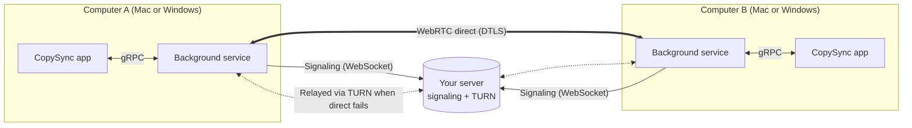

# How CopySync works

[简体中文](how-it-works.zh-CN.md) · [Back to README](../README.md)

Two computers connect directly and encrypt everything between them. Your server only helps them find each other, and relays encrypted packets when a direct connection can't be made.

## Architecture

| Component | Role | Built with |
|---|---|---|
| Background service `copysyncd` | Watches the clipboard, connects to peers, sends, receives and stores | Go. The clipboard uses cgo and AppKit on Mac, and calls Win32 directly on Windows (pure Go, no C compiler) |
| App `CopySync` | History, pairing, settings | Flutter, one codebase for Mac and Windows; talks to the service over local gRPC |
| Server `copysync-server` | Device discovery, pairing codes, signaling, TURN relay | Go, a single static binary using about 15 MB of RAM |
| Protocol `proto/` | Messages shared by all three | Protocol Buffers |

## What happens when you copy

1. The service notices the clipboard changed: on Mac it checks the change count at short intervals (reading the count and types needs no permission and never triggers a prompt); on Windows the system notifies it right away.
2. On a change it reads the content and picks a transport: text is inlined in the message; images and files under 50 MB are streamed right away (tar + zstd); anything larger is announced as a record only.
3. The receiving computer writes the data to a local cache and then onto its clipboard, so `⌘V` or `Ctrl+V` pastes real local files. File names that are fine on Mac but not on Windows (with a colon, say) get the matching full-width character on Windows.

## How the connection is made

1. Devices connect to the signaling server over WebSocket and receive STUN and TURN addresses.
2. All connections share one local UDP port. The background service probes several servers from that port to learn its public address, one per uplink on networks with several (see the next section).
3. During the handshake each side sends its LAN addresses, its public address on every uplink, and its TURN relay address; both sides try each other with WebRTC ICE at the same time. One side holds back its uplink addresses until it has received the other's and sent packets to them, because some routers lock a port when the other side's packet arrives first (see the next section).
4. A direct path wins if it works; relay paths must wait 5 seconds before they can be selected.
5. Once connected, each side tells the other whether it is relayed, and both show "relay" if either is.
6. If the connection still lands on the relay, the side that started it runs an ICE restart while idle to punch again, and moves to the direct path if that works (first after 10 seconds, then at intervals growing to 15 minutes).

Data flows over WebRTC data channels, encrypted with DTLS.

## Hole punching on networks with several uplinks

Office networks with two ISPs, or carriers with a pool of NAT addresses, have several uplinks and choose one per destination IP. One office network we measured had four:

| Uplink | Probe servers that landed on it | Public port |
|---|---|---|
| Uplink A | Our own server, Twilio | Unchanged |
| Uplink B | Bilibili, Google, Nextcloud | Unchanged |
| Uplink C | Cloudflare, FreeSWITCH | Rewritten, same for every destination |
| Uplink D | A service on Alibaba Cloud | Rewritten |

Asking one server reveals only one of these addresses. Packets to the peer may leave through another uplink, the peer sees an address it was never told about, and its router drops them. That is why CopySync 1.0 could only relay on such networks.

What 1.1 does:

- **One shared port.** pion used to open a new port for each STUN server, so each answer only applied to its own port. All connections now share one port, and every probe result applies to it.
- **Probe every uplink.** CopySync queries IP-diverse servers from that port in parallel (your own server plus public STUN servers such as Bilibili and Cloudflare), deduplicates by IP and drops addresses poisoned by DNS.
- **Tell the peer all of them.** Each uplink's address goes to the peer as a candidate; the peer checks each one, and the one matching the real uplink gets through. Uplinks that rewrite ports report their real mapping.
- **Remember uplinks.** If a round misses an uplink that preserves ports, its address is filled in as uplink IP plus local port.

A Mac behind that 4-uplink office network now connects directly to a home connection, about 3 seconds after reaching the server. The full design, measurements and validation are in [NAT traversal on multi-uplink networks](../design/nat-traversal.md) (Chinese).

The **NAT lab** (`tools/natlab`) builds real topologies with Linux network namespaces and iptables and runs CopySync's actual connection code through eleven scenarios on every commit:

| Scenario | Result |
|---|---|
| Single uplink ↔ home router | Direct |
| Two uplinks, previous version (control) | Relay |
| Two uplinks ↔ home router | Direct |
| Four uplinks ↔ home router | Direct |
| Two uplinks, second one not probed: no history / with history | Relay / Direct |
| Two uplinks ↔ two uplinks | Direct |
| Two uplinks ↔ NAT that randomizes ports | Relay |
| Blocked at first, network recovers later | Relay first, then direct |
| Office router locks a port for unsolicited packets | Direct |
| Home router locks a port for unsolicited packets | Relay, then direct after the first retry |

## Security model

- **The server keeps no accounts.** A device's identity is an Ed25519 key, and its ID is derived from the public key, so the server can verify that an ID belongs to a key without a user table.
- **Fingerprints are compared by a person when pairing.** Both Macs show the same two lines: the fingerprint of each side's public key (the first 60 bits of its SHA-256, like `R8NF-2WTC-QL5J`), in a fixed order. The server could swap keys in transit, but then the two screens would no longer match — this step is what stops a man in the middle. The fingerprints are shown separately rather than combined into one short code: an attacker controlling both forged keys could find a matching combined code with a birthday attack, while separate fingerprints need a preimage attack per key, roughly a billion times harder.
- **Every signaling message after that is signed**, so the server cannot forge a device. The DTLS certificate fingerprint of the direct channel is also sent signed and checked against the actual certificate after the handshake; a mismatch drops the connection.
- **The relay can't read anything either.** TURN only forwards encrypted UDP packets. Relay credentials are issued per device and expire after 12 hours.
- **Public STUN servers see only your public IP.** To find every uplink on multi-uplink networks, CopySync probes a few public STUN servers by default. They see your public IP, as with any WebRTC app, never content. Turn off **Probe with public servers** in Settings to use only your own server.
- **Device key.** On Mac it's stored readable only by you; on Windows it's additionally encrypted with DPAPI, so another user or another computer can't decrypt a copied file.
- **No App Sandbox**, because CopySync needs to read files at whatever path you copy them from.

## Fallbacks

| Situation | What happens |
|---|---|
| No direct path (symmetric NAT, corporate firewall) | Switches to the TURN relay on your server, still encrypted; the app shows "relay" |
| Public STUN servers unreliable (common in mainland China) | The server runs its own STUN and clients prefer it |
| Multi-uplink networks that pick an uplink per destination (common in offices) | All connections share one local port; CopySync probes several servers from it to learn its address on every uplink and sends them all to the peer, filling gaps from history. See `copysync-cli nat` |
| Landed on the relay although a direct path works (the peer just started, its addresses arrived a moment late) | While idle, the side that started the connection runs an ICE restart to punch again and switches to direct if it works; never during a transfer. The connection stays up and only pauses for a few seconds |
| The other Mac sleeps, loses its network or restarts, and the connection dies silently | The dead connection is closed and reconnected right away; if the other side rebuilt its connection, this side follows |
| The other Mac can't be reached when you copy | The latest 20 items are kept and sent once the connection is back. They only go into the history and never overwrite what's on the other Mac's clipboard now |
| Signaling connection drops | Reconnects with exponential backoff (1 s up to 30 s, with jitter); status is shown live |
| Pairing confirmed on one side before the other | Early handshake messages are held and replayed once the other side confirms; the direct link is up within tens of milliseconds |
| Large files | Above the limit only a record is synced; if the source file is gone when you pull, you get a clear message |
| Apps that only accept plain text | Rich text is written as both HTML and plain text, so no markup leaks into the paste |
| Clipboard access not granted yet | Content isn't read (it would block on a prompt a background process can't show); the app asks you to grant access |
| Background service crashes | launchd restarts it, throttled to once every 10 seconds |
| App updated in place, or moved | On launch the app re-points the login item and restarts the service on the new version |
| History and cache grow | Expired items are removed automatically; 3 days by default |

## Lessons learned

Each of these was found by testing and has a regression test. The full investigation is in [spikes/results.md](../spikes/results.md) (Chinese).

- **macOS clipboard calls must run on the main thread.** With the privacy features on, the clipboard API talks to a system UI service through the run loop; calling it from a plain thread crashes. The service locks the main thread at startup and dedicates it to the clipboard.
- **"Transfer only when the other side pastes" isn't possible on macOS.** The system resolves promised clipboard data about 0.1 s after it's written and caches it, and there is no notification that the clipboard was read. That's why small items are pushed ahead of time and large files are pulled on demand.
- **Three pitfalls in the pion WebRTC library:** `DetachDataChannels()` is a global switch that breaks regular send/receive on every channel; `OnMessage` doesn't buffer, so messages arriving before the handler is set are dropped (202 bytes sent, 0 received); `OnBufferedAmountLow` is edge-triggered, so a waiter that arrives late never wakes up (a 20 MB transfer stalled at 786 KB).
- **pion opens a separate port per STUN server**, so the answers don't apply to each other. Adding STUN servers can't fix multi-uplink networks; all connections now share one port and CopySync probes it itself.
- **One side can't tell on its own whether a connection is relayed.** When one side sends through TURN, the other may just see an ordinary address; once one Mac showed "direct" and the other "relay". Both sides now tell each other after connecting.
- **pion never switches paths once it has picked one.** The relay handshake is fast, and if it wins that race the whole connection stays relayed. We saw exactly that after the peer restarted: its addresses arrived after the relay wait had expired. The relay wait is now 5 seconds, probe hostnames resolve in parallel (a probe round went from about 1.6 s to under 0.2 s), and relayed connections retry the direct path with an ICE restart.
- **Who sends first matters.** Some routers (the office one we measured) keep a connection entry for a packet that arrives before you've sent anything to its source, locking the port; your own packets then leave from a different port and punching fails. That's why restarting the office Mac always connected directly while restarting the home Mac fell back to the relay: a freshly started Mac probes its uplinks first, so its addresses went out late and it ended up sending first. A rule now decides who sends first, and retries alternate the order.
- **A dead connection has to be cleaned up by hand.** When pion reports "failed" it doesn't close the connection; the control channel still looks open and whatever is written to it is lost, and the layer above thinks it's connected and never reconnects. In 1.1.0 this sent six files into a dead connection after the other Mac dropped off, and none arrived.
- **Public STUN domains can be poisoned by DNS**, resolving to `192.0.2.42` in our tests. Reserved ranges and proxy fake-IP ranges are filtered before probing.
- **Simulated routers need a firewall.** When both sides punch at once, a packet let through to the router itself leaves a Linux conntrack entry, the outgoing flow then gets a new port, and punching fails. Real routers drop such packets, and the lab does too.

Measured on a LAN with a direct connection: a 20 MB file transfers in about 330 ms with matching checksums.
