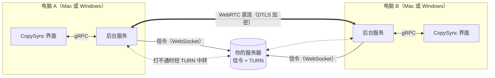

# CopySync 的工作原理

[English](how-it-works.md) · [回到 README](../README.zh-CN.md)

两台电脑之间直接建立加密连接。你的服务器只负责让它们找到彼此，打不通直连的时候再帮忙转发加密后的数据包。

## 架构

| 组件 | 做什么 | 技术 |
|---|---|---|
| 后台服务 `copysyncd` | 监听剪贴板、与对端建立连接、收发与落盘 | Go。剪贴板部分在 Mac 上用 cgo 调用 AppKit，在 Windows 上直接调用 Win32（纯 Go，不需要 C 编译器） |
| 界面 `CopySync` | 复制记录、设备配对、设置 | Flutter，经本机 gRPC 与后台服务通信；Mac 与 Windows 共用一套代码 |
| 服务器 `copysync-server` | 设备发现、转达配对码、转发信令、TURN 中转 | Go，单个静态二进制，约 15 MB 内存 |
| 协议 `proto/` | 三方共用的消息定义 | Protocol Buffers |

## 一次复制的经过

1. 后台服务发现剪贴板变了：Mac 上每隔一小段时间检查剪贴板的变更计数（只看计数和类型不需要授权，也不会触发系统提示）；Windows 上由系统即时通知。
2. 发现变化后读取内容，按类型和大小决定怎么传：文本直接内联在消息里；50 MB 以内的图片与文件打包成流（tar + zstd）立即推送；更大的只发一条记录。
3. 对端收到后先写入本地缓存，再写入剪贴板。在那台电脑上 `⌘V` 或 `Ctrl+V` 粘贴出来的，就是本地的真实文件。Mac 上合法、Windows 上不合法的文件名（比如带冒号的）在 Windows 上换成对应的全角字符。

## 连接是怎么建立的

1. 设备通过 WebSocket 连上信令服务器，拿到 STUN 与 TURN 的地址。
2. 所有连接共用一个本地 UDP 端口。后台服务在这个端口上向多台服务器探测本机的公网地址，网络有几个出口就能拿到几个地址（见下一节）。
3. 握手时把局域网地址、每个出口的公网地址、TURN 中转地址都发给对端，两边用 WebRTC 的 ICE 同时互相尝试。其中一方先不公布出口地址，等收到对方的、先往那边发过包再公布：有的路由器会被对方先到的包占住端口（见下一节）。
4. 直连打通就走直连；中转路径至少等 5 秒才允许被选中，给直连留出时间。
5. 连上后两端互相告知自己是否经过中转，任一端经中转，两边都显示「中转」。
6. 若还是先落到了中转，发起连接的一方会在空闲时用 ICE 重启再打一次洞，打通就换成直连（10 秒后第一次，之后间隔逐步拉长到 15 分钟）。

数据走 WebRTC 数据通道，DTLS 加密。

## 多出口网络的打洞

公司双线、运营商 NAT 地址池这类网络有多个出口，按目标 IP 选择走哪一个。实测一个公司网络有 4 个出口：

| 出口 | 落在这个出口上的探测服务器 | 公网端口 |
|---|---|---|
| 出口 A | 自己的服务器、Twilio | 不变 |
| 出口 B | B 站、Google、Nextcloud | 不变 |
| 出口 C | Cloudflare、FreeSWITCH | 改写，但对不同目标相同 |
| 出口 D | 阿里云上的服务 | 改写 |

只问一台服务器，就只知道其中一个出口的地址；发往对端的包按目标 IP 很可能从另一个出口出去，对端收到的源地址对不上，被它的路由器丢弃。CopySync 1.0 就是这样只能走中转。

1.1 的做法：

- **共用一个端口**：之前 pion 每问一台 STUN 服务器就开一个新端口，问到的地址只对那个端口成立。现在所有连接共用一个端口，探测结果对它全部成立。
- **探测每个出口**：在这个端口上并发探测 IP 分散的服务器（自己的服务器，加上 B 站、Cloudflare 等公共 STUN），按 IP 去重，过滤被 DNS 污染的地址。
- **全部告诉对端**：每个出口的地址都作为候选地址发给对端，对端逐个检查，与实际出口吻合的那个能打通。会改写端口的出口拿到的是真实映射。
- **记住见过的出口**：某一轮漏掉的出口，若它不改端口，就按「出口 IP + 本地端口」推算补上。

实测公司 4 个出口与家用宽带之间直连，连上服务器后约 3 秒建立。设计细节、测量过程与验证见 [多出口网络的 NAT 打洞](../design/nat-traversal.md)。

**NAT 打洞实验室**（`tools/natlab`）用 Linux 网络命名空间与 iptables 搭出真实拓扑，用 CopySync 真实的连接代码验证 11 种场景，每次提交都在 CI 里运行：

| 场景 | 结果 |
|---|---|
| 单出口 ↔ 家用路由器 | 直连 |
| 两个出口，旧版本（对照） | 中转 |
| 两个出口 ↔ 家用路由器 | 直连 |
| 四个出口 ↔ 家用路由器 | 直连 |
| 两个出口，第二条没探测到：无历史 / 有历史 | 中转 / 直连 |
| 两个出口 ↔ 两个出口 | 直连 |
| 两个出口 ↔ 端口随机分配的 NAT | 中转 |
| 一开始打不通，之后网络恢复 | 先中转，随后换成直连 |
| 公司路由器会为外来的包占住端口 | 直连 |
| 家用路由器会为外来的包占住端口 | 先中转，第一次重试后直连 |

## 安全模型

- **服务器不存账号**。设备身份是一把 Ed25519 密钥，设备 ID 由公钥派生，服务器据此就能验证"这个 ID 确实属于这把公钥"，无需用户表。
- **配对时人工核对指纹**。两台设备显示同样的两行：双方各自公钥的指纹（SHA-256 的前 60 位，形如 `R8NF-2WTC-QL5J`），按固定顺序排列。服务器可以在配对时替换转发中的公钥，但替换后两块屏幕上的内容就对不上了，这一步就是防中间人的闸门。两个指纹分开显示而不是合成一串短码，是因为攻击者同时控制两把伪造公钥时，凑出一串相同的短码只需生日攻击；分开显示则要为每把公钥各做一次原像攻击，难度高出约十亿倍。
- **之后的每条信令都带签名**，服务器无法伪造设备。直连通道的 DTLS 证书指纹也经签名传递，握手后比对实际证书，不一致立即断开。
- **中转也看不到内容**。TURN 只转发加密后的 UDP 包。中转凭证按设备单独签发，12 小时过期。
- **公共 STUN 服务器只看到公网 IP**。为了在多出口网络里找到每个出口，默认会向几台公共 STUN 服务器探测，它们能看到你的公网 IP（与任何 WebRTC 应用一样），看不到内容。介意的话在设置里关掉「用公共服务器探测网络出口」，只用自己的服务器。
- **设备私钥**：Mac 上以仅本人可读的权限存放；Windows 上另用系统的 DPAPI 加密，换个用户、或把文件拷到别的电脑上都解不开。
- **不启用 App 沙盒**：需要访问你复制的任意路径下的文件。

## 兜底：出问题时会发生什么

| 情况 | 处理方式 |
|---|---|
| 两端打不通直连（对称 NAT、公司防火墙） | 自动改走服务器的 TURN 中转，内容依然加密；界面上显示「中转」 |
| 公共 STUN 在国内时通时断 | 服务器自带 STUN，客户端优先用它 |
| 公司双线等多出口网络（按目标地址选出口） | 所有连接共用一个本地端口，在这个端口上向多台服务器探测每个出口的地址，全部发给对端由它逐个尝试；探测漏掉的出口按历史推算。`copysync-cli nat` 可以看到探测结果 |
| 先落到了中转，其实打得通（对端刚启动、出口地址晚到一步） | 发起方在空闲时用 ICE 重启再打一次洞，打通就换成直连；有传输在进行时不重启。重启期间连接不断，只停顿几秒 |
| 对方睡眠、断网、重启，连接悄悄断了 | 发现连接失效立即关闭、重连；对方重建了连接，本端也随之换新 |
| 复制时对方连不上 | 记下最近 20 条，连接恢复后补发。补发的只进复制记录，不写进对方的剪贴板，免得覆盖对方此刻正在用的内容 |
| 信令服务器断开 | 指数退避自动重连（1 秒起，最长 30 秒，带随机抖动），界面实时显示连接状态 |
| 配对时两端确认有先后 | 先确认一方发来的握手消息会被暂存，另一方确认后重放，配对完成几十毫秒内即可直连 |
| 大文件 | 超过阈值只同步记录，按需拉取；拉取时源文件已被删除会明确提示，而不是失败得不明不白 |
| 只认纯文本的输入框 | 带格式的文本同时写入 HTML 与纯文本两份，粘贴到哪里都不会出现标签 |
| 还没有授权读取剪贴板 | 不去读内容（否则会卡在一个后台进程看不见的系统弹窗上），界面上提示去授权 |
| 后台服务崩溃 | 由 launchd 自动拉起；10 秒节流，不会疯狂重启 |
| 覆盖安装了新版、或 App 换了位置 | 打开 App 时自动校正登录项，并重启到新版本 |
| 记录和缓存越来越多 | 到期自动清理，默认保留 3 天 |

## 踩过的坑

这些都是实测撞出来的，各自对应一个回归测试。完整的验证过程见 [spikes/results.md](../spikes/results.md)。

- **macOS 的剪贴板调用必须在主线程。**开启隐私机制后，剪贴板 API 要经系统 UI 服务通信，依赖 run loop，在普通线程上调用会直接崩溃。后台服务启动时就把主线程锁住，专门留给剪贴板，业务逻辑投递过去执行。
- **"对方按下粘贴键才传输"在 macOS 上做不到。**系统在写入剪贴板后约 0.1 秒就会把延迟提供的数据兑现并缓存，真正按下 `⌘V` 时不再回调，也没有"剪贴板被读取"的通知。所以小文件是预先推送的，大文件改为手动拉取。
- **WebRTC 库（pion）的三个坑**：`DetachDataChannels()` 是全局开关，开了以后所有通道的普通收发都失效；`OnMessage` 不缓冲，回调设置之前到达的消息直接丢弃（实测发 202 字节，收到 0 字节）；`OnBufferedAmountLow` 是边沿触发，等待方晚一步进入等待就再也等不到唤醒（20 MB 传到 786 KB 卡死）。
- **pion 为每台 STUN 服务器单独开端口**，问到的地址互相用不上。多出口网络里多配几台 STUN 也打不通，所以改为所有连接共用一个端口、由自己探测。
- **单靠一端判断不了是否中转。**一端经 TURN 发送时，另一端看到的可能只是个普通地址，曾出现一台显示直连、一台显示中转。现在连接就绪后两端互相告知。
- **pion 选定线路后就不再更换。**中转握手快，一旦赢了这场赛跑，整个连接期间都走中转。实测对端重启后的第一次握手，出口地址比中转的等待时限晚到，就这样一直中转。现在中转等待放宽到 5 秒、探测时并发解析域名（整轮从约 1.6 秒降到 0.2 秒以内），并在中转时用 ICE 重启再试直连。
- **谁先发包很重要。**有的路由器（实测公司那台）收到对方先到的包，会留下一条连接记录、占住端口，本端随后往外发只好换端口，打洞就失败了。这解释了为什么本机重启时总能直连、家里那台一重启就中转：本机重启时出口要现探测，地址晚发出，本机反而先发包。现在由规则决定谁先发包，换直连的重试里两种顺序轮流用。
- **连接失效后要自己清理。**pion 报告「失败」后不会关闭连接，控制通道看上去还是打开的，写进去的消息石沉大海；上层以为连接还在，也不会重连。1.1.0 曾因此在对方断线后，把 6 个文件「发」进了一条死连接，对方一个也没收到。
- **公共 STUN 域名可能被 DNS 污染**，实测被解析到 `192.0.2.42`。这类保留地址和代理软件的 fake-ip 网段在探测前就过滤掉。
- **测试用的模拟路由器要有防火墙。**两端同时打洞时，对方的包若被放行到路由器本机，Linux 会为它留下一条连接记录，本端随后往外发时只好换端口，打洞就失败了。真实路由器直接丢弃这类包，实验室也照此配置。

局域网直连实测：20 MB 文件约 330 毫秒传完，校验和一致。
